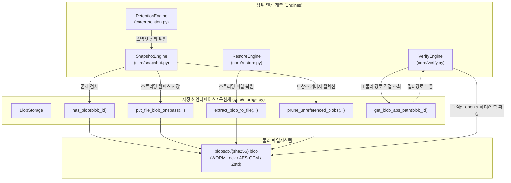
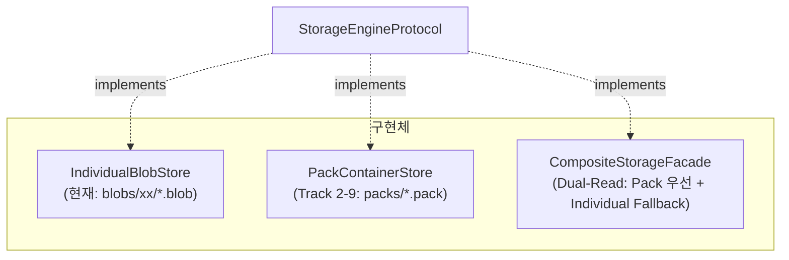

# Track 2-9A Storage Abstraction Boundary & Call Graph 분석 보고서

본 문서는 `BackupSystem`의 장기 저장소 아키텍처(개별 파일 vs Pack Container vs 복합 저장소)를 상위 계층(`SnapshotEngine`, `RestoreEngine`, `VerifyEngine`, `RetentionEngine`)과 안전하게 분리하기 위한 **최소 저장소 추상화 경계(Storage Abstraction Boundary)** 및 **호출 그래프(Call Graph)** 분석 보고서입니다.

---

## 1. 실제 호출 그래프 (Caller → Method → Physical Storage Dependency)

현재 백업 엔진 코어 모듈들의 저장소 접근 경로를 전수 추적한 호출 그래프입니다.



### 1.1 Restore 경로 (`core/restore.py`)
- **Caller**: `RestoreEngine._restore_one()`
- **Method**: `storage.extract_blob_to_file(blob_id, dest_path, verify_hash=...)`
- **물리 결합 상태**: **이미 완전 캡슐화됨 (Clean)**.
  - 상위 계층은 `dest_path`만 넘기며, 내부에서 `get_blob_abs_path()`를 거쳐 복원 스트리밍을 수행합니다. 외부 물리 누수가 없습니다.

### 1.2 Verify 경로 (`core/verify.py`) — 🚨 유일한 물리 누수 지점
- **Caller**: `VerifyEngine.verify_blob(sha256_hash)`
- **Method**: `self.storage.get_blob_abs_path(sha256_hash)`
- **물리 결합 상태**: **심각한 물리 누수 (Direct Leak)**.
  - `verify_blob`이 절대 파일 경로를 얻어 직접 `open(abs_path, 'rb')`를 호출.
  - 파일 매직 헤더(`ENC\x01`, `ZSTD_MAGIC`), 복호화 핸들러, 스트리밍 zstd 디컴프레서를 `verify.py`가 직접 제어하고 있습니다.
  - 이로 인해 저장소가 Pack Container로 바뀌면 `verify.py`가 깨지게 됩니다.

### 1.3 Snapshot Ingest 경로 (`core/snapshot.py`)
- **Caller**: `SnapshotEngine`
- **Method**:
  - `storage.has_blob(blob_id)` (중복 체크)
  - `storage.put_file_blob_onepass(src_path, ...)` (원패스 해싱/암호화/WORM 저장)
  - `storage.bulk_add_blob_cache(ids)` (인메모리 캐시 갱신)
  - `storage.prune_unreferenced_blobs(active_hashes)` (GC)
- **물리 결합 상태**: **완전 캡슐화됨 (Clean)**.
  - 상위 계층은 blob ID 문자열과 소스 파일 경로만 전달합니다.

### 1.4 Retention 경로 (`core/retention.py`)
- **Caller**: `RetentionEngine.apply_retention_policy()`
- **Method**: `SnapshotEngine.prune_storage(self.repo_dir)` → 내부에서 `storage.prune_unreferenced_blobs()` 호출
- **물리 결합 상태**: **완전 캡슐화됨 (Clean)**.

---

## 2. 물리적 결합 지점 목록 (Coupling Points)

| 모듈 및 위치 | 대상 심볼 / 메서드 | 결합 유형 | 문제점 및 영향도 |
| :--- | :--- | :--- | :--- |
| `core/verify.py:68` | `get_blob_abs_path(hash)` | **외부 직접 결합 (Direct Leak)** | Blob이 개별 파일(`.blob`)로 디스크에 존재함을 전제함. Pack Container나 원격 저장소 도입 시 즉시 장애 발생. |
| `core/verify.py:75-105` | `open(abs_path, 'rb')`, `ENC\x01`, `zstd` | **포맷 직접 결합** | 암호화 포맷 및 압축 인코딩 검사 로직이 저장소 엔진 바깥에 중복 노출됨. |
| `core/storage.py:112` | `get_blob_abs_path(hash)` | **공개 API 누수** | 내부 구현용 헬퍼가 외부에 공개되어 `verify.py`에서 불필요하게 소비됨. |
| `core/storage.py:348` | `prune_unreferenced_blobs` | **내부 순회 결합** | `os.walk(self.blobs_dir)`로 `.blob` 파일을 순회 삭제함. 상위 계층 누수는 없으나 저장소 내부 로직에 포함. |

**핵심 진단**:
전체 코드베이스에서 `blobs/xx/{sha256}.blob`라는 물리 경로를 직접 열어보고 있는 외부 모듈은 **`core/verify.py` 단 하나**뿐입니다.

---

## 3. Plan A (Streaming ChunkStore) vs Plan B (Thin Facade) 비교

| 비교 항목 | Plan A: Streaming ChunkStore Protocol | Plan B: Thin Storage Facade |
| :--- | :--- | :--- |
| **추상화 방식** | Python `Protocol` 기반 인터페이스 분리 (`ChunkStoreProtocol`) | 기존 `BlobStorage`에 `verify_blob`을 편입하고 점진적 인터페이스 정의 |
| **인터페이스 형태** | `contains`, `store_file_onepass`, `extract_to_file`, `verify_chunk`, `prune` | `has_blob`, `put_file_blob_onepass`, `extract_blob_to_file`, `verify_blob`, `prune_unreferenced_blobs` |
| **코드 변경 범위** | 중간 (인터페이스 선언 파일 추가 + 타입 힌트 교체) | 최소 (`verify.py` 15줄 수정, `storage.py` 25줄 추가) |
| **기존 엔진 영향도** | 무영향 (시그니처를 스트리밍/파일 단위로 유지 시) | 무영향 (100% 하위 호환) |
| **WORM / 암호화 보존** | 구현체 내부(`IndividualBlobStore`)로 완벽 은닉 | `BlobStorage` 내부 기존 로직 100% 그대로 유지 |
| **Pack Container 교체성** | **우수**: 향후 `PackStorage`가 동일 Protocol 구현 시 즉시 교체 가능 | **양호**: `BlobStorage`를 상속하거나 Wrapper로 구현 가능 |
| **설계 적합성** | 장기적 엔지니어링 표준 | 단기적 퀵픽스 |

### 트레이드오프 분석:
- 사용자 피드백에서 지적된 바와 같이, Plan A를 "인메모리 바이트 기반의 순수 KV (`put(bytes)/get(bytes)`)"로 정의하면 10GB 대형 파일의 One-Pass 스트리밍, AES-GCM 무결성, NTFS WORM ACL 락킹이 깨지는 치명적인 문제가 발생합니다.
- 그러나 **"스트리밍 및 파일 경로 중심의 고수준 Protocol"**로 Plan A를 정의하면, Plan B의 단순함과 Plan A의 확장성을 완벽하게 양립할 수 있습니다.

---

## 4. 권장 최소 추상화 경계 (Streaming-oriented `StorageEngineProtocol`)

물리적 레이아웃(`blobs/xx/*.blob`)을 상위 계층에서 완전히 차단하는 최소 계약은 아래와 같습니다:

```python
from typing import Protocol, Optional, Set, List, Tuple
from pathlib import Path

class StorageEngineProtocol(Protocol):
    """
    상위 계층(Snapshot, Restore, Verify, Retention)이 바라보는
    저장소 최소 추상화 계약 (물리 레이아웃 완전 은닉)
    """

    def has_blob(self, blob_id: str) -> bool:
        """Blob 존재 여부 확인 (캐시 또는 인덱스 조회)"""
        ...

    def put_file_blob_onepass(
        self,
        src_path: Path,
        expected_hash: Optional[str] = None
    ) -> Tuple[str, int, int]:
        """
        One-Pass 스트리밍 저장:
        입력 파일 스트림 -> 해시 계산 -> 압축 -> 암호화 -> 저장소 기록 -> WORM Lock.
        Returns: (sha256_hash, compressed_size, original_size)
        """
        ...

    def extract_blob_to_file(
        self,
        blob_id: str,
        dest_path: Path,
        verify_hash: Optional[str] = None
    ) -> bool:
        """
        스트리밍 복원:
        저장소 읽기 -> 복호화 -> 압축 해제 -> 목적지 파일 스트리밍 기록 -> 해시 검증.
        """
        ...

    def verify_blob(self, blob_id: str) -> Tuple[bool, Optional[str]]:
        """
        🚨 유일한 물리 누수를 해결하는 검증 메서드:
        저장소 구현체가 직접 내부 Blob 무결성(매직헤더, 암호화, 압축 해제 스트림)을 검증.
        Returns: (is_valid, error_message)
        """
        ...

    def prune_unreferenced_blobs(self, active_hashes: Set[str]) -> int:
        """미참조 가비지 정리 (GC): 물리적 순회 또는 Pack 재패킹"""
        ...

    def bulk_add_blob_cache(self, blob_ids: List[str]) -> None:
        """인메모리 캐시 갱신"""
        ...
```

---

## 5. WORM, 암호화, One-Pass 스트리밍 보존 방안

1. **WORM (NTFS ACL) 불변성 보존**:
   - 기존의 `lock_file_immutable()` 호출은 `put_file_blob_onepass()` 내부에서 최종 기록 직후 수행되므로, 저장소 인터페이스 내부의 책임으로 완벽하게 격리됩니다.
   - 상위 계층은 ACL이나 읽기 전용 권한을 알 필요가 없습니다.
2. **AES-256-GCM 암호화 보존**:
   - 저장/복원 시의 스트리밍 암/복호화(`CryptoAtRestEngine`)는 저장소의 `put` / `extract` / `verify` 내부에서 처리됩니다.
3. **One-Pass Ingest 성능 유지**:
   - `put_file_blob_onepass`는 파일 디스크립터 또는 파일 경로를 직접 인자로 받아 청크 버퍼(64KB) 단위로 스트리밍 처리하므로, 10GB 대형 파일 처리 시에도 메모리 점유율이 20MB 이하로 유지됩니다.

---

## 6. 향후 PackStore / CompositeStore 교체 용이성

이 최소 경계가 확립되면 향후 Pack Container 통합 시 다음과 같이 코드를 수정 없이 교체할 수 있습니다:



- **복합 저장소 (`CompositeStorageFacade`)**:
  - `has_blob`: Pack 인덱스 먼저 조회 → 없으면 Individual 파일시스템 확인.
  - `extract_blob_to_file`: Pack 인덱스에 오프셋이 있으면 Pack 파일에서 슬라이스 읽기 → 없으면 Individual blob에서 추출.
  - `verify_blob`: 위치에 따라 Pack 블록 검증 또는 개별 파일 검증 수행.
- **결과**: `SnapshotEngine`, `RestoreEngine`, `VerifyEngine`은 코드를 단 한 줄도 고칠 필요가 없습니다.

---

## 7. 예상 변경 파일 및 코드 라인 수

| 파일 경로 | 작업 내용 | 예상 변경 라인 |
| :--- | :--- | :---: |
| `core/storage.py` | `BlobStorage.verify_blob()` 메서드 추가 (내부 무결성 검사)<br>`get_blob_abs_path`를 프라이빗/내부 전용으로 정리 | +35 lines, -0 lines |
| `core/verify.py` | `self.storage.get_blob_abs_path()` 직접 호출 제거<br>`self.storage.verify_blob()` 호출로 단축 대체 | +8 lines, -32 lines |
| **합계** | **최소 침습적 리팩토링 (2개 파일)** | **약 43 lines** |

- 프로덕션 전체 5,000+ 라인 중 단 43라인의 변경만으로 외부 물리 누수가 100% 제거됩니다.

---

## 8. 운영 데이터 무변경 보장 검증 (`D:\MyBackup_Repository`)

- **저장소 레이아웃 불변**: `blobs/xx/{sha256}.blob`의 디스크 생성 규칙, 파일 확장자, 디렉터리 분할 규칙은 1바이트도 변경되지 않습니다.
- **메타데이터 불변**: SQLite 스냅샷 DB, 매니페스트 포맷 변경 없음.
- **실제 백업 저장소 무접근**: 본 작업 및 향후 적용 시 `D:\MyBackup_Repository`는 일체 건드리지 않으며 읽기/쓰기/마이그레이션이 발생하지 않습니다.
